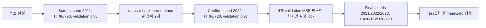

# LightNorm 저널 보완 실험 코드베이스

> 상태 기준일: 2026-10-07  
> 구현 상태: 실험 프로토콜·FAN·TimeMixer++ 어댑터·멀티 GPU 스케줄러·분산 실행(결과 패키징/미완료 채우기) 구현 및 검증 완료  
> 전체 벤치마크 상태: 실험 1~3 실행 중 (Elice A100 80GB × 2, RTX A4000). 진행 현황은 `results/summary/progress.md`  
> 최종 실험 상태: DDN·FAN 탐색 그리드 확정(§6.2). TimeMixer++(실험 4) 범위는 실험 1~3 이후 결정

이 디렉터리는 저널 재제출을 위한 LightNorm 보완 실험 전용 작업본이다. 사용자가 제공한 `LightNorm.zip`을 별도 위치에 풀어 수정했으며, 원본 ZIP과 ChatGPT 프로젝트의 `sources/` 아래 자료는 수정하지 않았다.

이 README는 다음 세 가지를 한 문서에서 관리한다.

1. 왜 이 실험을 수행하는지와 어떤 비교가 논문에서 방어 가능한지
2. 현재 코드에 무엇이 구현되어 있고 무엇이 검증되었는지
3. 최종 대규모 실행 전에 연구자가 직접 확정해야 하는 결정 사항

---

## 0. 여러 서버에서 실행하기 (결과 패키징 + 미완료 채우기)

`main` 브랜치 하나가 코드와 결과 저장소를 겸한다. 각 서버는 `git pull` → 미완료 작업 claim → 실행 → 결과 push를 반복하며, 서버 간 중복 실행 없이 동시에 진행된다. 이전 코드베이스는 `deprecated` 브랜치에 보존되어 있다.

```text
results/store/<phase>/<dataset>/<backbone>/<run_id>.csv  완료된 cell 1개 = 파일 1개 (push 충돌 없음)
results/claims/<task>.json                              실행 중인 작업의 임대(lease)와 heartbeat
results/summary/                                        자동 생성: progress.md, final_test_mean_std.csv, selection_*.json
```

- **작업 단위(task)**: `configs/distributed_plan.json`의 phase × dataset × backbone (예: `exp2-search--ETTh1--DLinear`).
  우선순위는 실험 1 → 실험 2 search → confirm → 실험 3이며, 같은 우선순위 안에서는 예상 시간이 짧은 case부터 실행한다.
- **의존성**: confirm은 같은 case의 search 결과로 shortlist를, 실험 3의 RevIN/SAN/DDN/FAN은 confirm 결과로 lock을
  그 자리에서 계산한다. 어느 서버가 만든 결과든 저장소에 들어오면 다음 단계가 열린다.
- **claim**: 한 번에 task 하나를 push로 선점한다. 동시 push 경합은 최신 상태로 reset 후 재시도하므로 한 서버만 이긴다.
  heartbeat가 lease(기본 3시간)보다 오래되면 다른 서버가 이어받는다. 실패한 cell이 있는 task는 `failed`로 표시되고
  로그 끝부분이 claim 파일에 남는다. 원인을 고친 뒤 `fill_missing.py release <task>`로 다시 열 수 있다.
- **재현성 기록**: 각 cell에 Host, GPU, torch 빌드, 코드 revision, 소요 시간이 함께 저장된다.
  원격 `main`의 코드가 바뀌면 worker는 실행 중인 cell만 끝내고 종료하며, `start_worker.sh`가 새 코드로 재시작한다.

```bash
# 새 서버 준비: clone → 격리된 .venv(Python 3.10 + torch 2.1.0) → 데이터 다운로드
git clone git@github.com:bigbases/Normalizer.git && cd Normalizer
bash scripts/setup_container.sh --data-root ~/datasets        # 기존 conda/system Python은 건드리지 않음

# 미완료 목록 (전체 / 특정 phase의 run ID까지)
.venv/bin/python experiments/fill_missing.py list
.venv/bin/python experiments/fill_missing.py list --phases exp2-search --cells

# worker 시작 (tmux 세션 lightnorm-worker, 로그 .worker/worker.log)
bash scripts/start_worker.sh --data-root ~/datasets                       # 모든 GPU, 모든 데이터셋
bash scripts/start_worker.sh --data-root ~/datasets --gpus 0 \
     --datasets ETTh1,ETTh2,ETTm1,ETTm2,Weather                             # 가벼운 작업만 (A4000 등)

# run_matrix.py/run_pipeline.sh로 따로 돌린 결과를 저장소에 넣기 (멱등)
.venv/bin/python experiments/results_pack.py pack --from results \
     --host <서버명> --gpu "NVIDIA A100 80GB PCIe" --torch 2.1.0+cu121 --push
.venv/bin/python experiments/results_pack.py summary --push               # 요약 재생성
.venv/bin/python experiments/results_pack.py export --out all_cells.csv   # 전체 cell을 CSV 하나로
```

worker는 GitHub에 push할 수 있어야 한다(서버별 deploy key 또는 계정 SSH 키). checkout의 추적 파일을 직접 수정한 상태나
push되지 않은 코드 커밋이 있으면 worker는 시작하지 않는다(저장소를 원격 상태로 reset하기 때문).

---

## 1. 연구 목적

현재 보완 실험의 핵심 질문은 다음과 같다.

1. LightNorm의 개선이 특정 구형 백본에만 나타나는가, 아니면 최근의 강한 백본인 TimeMixer++에서도 유지되는가?
2. 같은 백본·데이터 분할·학습 예산을 고정했을 때 LightNorm이 NoNorm, RevIN, SAN, DDN, FAN과 공정하게 비교되는가?
3. 단일 실행 결과가 아니라 동일한 seed 집합에서 평균과 분산을 제시할 수 있는가?
4. 하이퍼파라미터 선택 과정에서 test split을 사용하지 않았다고 재현 가능하게 증명할 수 있는가?
5. 기존 rebuttal 결과 중 seed가 기록되지 않은 결과를 과도하게 해석하지 않고, 저널용 최종 결과를 새로 생성할 수 있는가?

현재 프로토콜의 기본 원칙은 다음과 같다.

- 백본의 구조와 백본 하이퍼파라미터는 dataset–backbone 단위로 고정한다.
- 비교 중 바뀌는 것은 외부 정규화 모듈과 해당 모듈의 전용 하이퍼파라미터뿐이다.
- 모듈 설정은 validation split에서만 선택한다.
- test split은 설정 고정 이후 최종 실행에서 한 번만 평가한다.
- 최종 결과는 seed `2021`, `2022`, `2023`의 matched-seed 결과로 생성한다.
- seed가 남아 있지 않은 기존 rebuttal 결과는 `seed unrecorded`로만 보존하고 최종 3-seed 표에는 사용하지 않는다.

---

## 2. 현재 구현 상태 요약

| 영역 | 상태 | 현재 구현 |
|---|---:|---|
| 원본 코드 작업본 | 완료 | 원본을 건드리지 않는 별도 writable copy |
| 제공 설정 반영 | 완료 | `configs/base_configs.json`에 사용자 제공 JSON의 동일한 스냅샷 보관 |
| seed 관리 | 완료 | 2021/2022/2023을 독립 process·checkpoint·RunID로 실행 |
| test leakage 방지 | 완료 | search/confirm 단계는 test loader 자체를 생성하지 않음 |
| FAN | 완료 | 원저자 구조와 residual/main-frequency 복합 손실 이식 |
| TimeMixer++ | 조건부 완료 | PyPOTS BSD-3-Clause 재구현용 어댑터 작성; 소스 선택 미확정 |
| 고정 백본 비교 | 완료 | NoNorm/RevIN/SAN/DDN/FAN/LightNorm 매트릭스 생성 |
| 설정 탐색·고정 | 완료 | screen → top-2 → confirm → lock 자동화 |
| 결과 재개 | 완료 | 정확히 동일한 RunID 또는 검증된 config hash만 건너뜀 |
| 멀티 GPU | 완료 | GPU당 1–4개 single-GPU worker, 실시간 자원 기반 배치 |
| Discord 알림 | 완료 | dataset–backbone case N개 완료 단위 알림 |
| 단위 테스트 | 완료 | 8개 테스트 통과 |
| 합성 데이터 학습 | 완료 | FAN+DLinear validation-only 경로 end-to-end 확인 |
| TimeMixer++ forward | 완료 | PyPOTS source를 이용해 `(2,96,7) → (2,24,7)` 확인 |
| 실제 전체 벤치마크 | 미실행 | 데이터 경로·GPU 서버·남은 결정 확정 필요 |
| 최종 통계 표 생성 | 미구현 | 현재 CSV 원자료까지만 생성; 집계/유의성 표 스크립트는 추가 필요 |

---

## 3. 원본 코드에서 발견해 수정한 문제

### 3.1 `label_len` 강제 덮어쓰기

기존 `run_longExp.py`는 CLI와 제공 설정의 `label_len`을 받은 뒤 항상 `seq_len // 2`로 덮어썼다. 예를 들어 iTransformer의 `seq_len=720, label_len=168` 설정이 실제로는 `label_len=360`으로 실행될 수 있었다.

현재는 제공된 값을 그대로 사용한다. 과거 동작이 정말 필요한 경우에만 `--force_label_len_half`를 명시해야 한다.

### 3.2 학습 중 test split 반복 평가

기존 학습 루프는 매 epoch마다 validation과 test를 모두 평가했다. test loss가 early stopping에 직접 사용되지는 않았지만, 연구자가 학습 중 test 추이를 볼 수 있어 하이퍼파라미터 선택 과정의 독립성을 약화시킨다.

현재 기본 동작은 다음과 같다.

- `search`, `confirm`: test dataset과 loader를 생성하지 않는다.
- `final`: validation으로 checkpoint를 선택한 뒤 `test()`를 한 번 호출한다.
- `--monitor_test_during_training`: 레거시 디버깅용으로만 남겨 두었으며 저널 실험에서는 사용하면 안 된다.

### 3.3 seed와 checkpoint 충돌

기존 `--itr` 반복은 seed를 명시적으로 다시 설정하지 않았고 setting 문자열에도 seed가 없었다. 여러 실행이 같은 checkpoint 경로를 공유할 수 있었다.

현재는 다음 값이 모두 setting과 결과에 포함된다.

- seed
- candidate ID
- 전체 effective configuration hash
- 안정적인 RunID

저널 매트릭스는 항상 `itr=1`로 실행하고 seed별 process를 별도로 만든다.

### 3.4 정규화 모듈 learning rate

기존 joint training은 정규화 모듈 파라미터를 백본 optimizer에 백본 learning rate로 넣었다. 따라서 설정에 존재하던 `station_lr`가 joint phase에서 사실상 무시될 수 있었다.

현재는 백본 optimizer와 정규화 optimizer를 분리한다.

- 백본: `learning_rate`
- 정규화 모듈: `station_lr`

### 3.5 RevIN affine 파라미터 학습 누락

기존 RevIN의 affine 파라미터는 생성되지만 joint optimizer에 포함되지 않았다. 현재 `affine=1`이면 backbone과 함께 학습하며, `affine=0`이면 parameter-free 모듈로 처리한다.

### 3.6 validation loader의 임의 순서와 샘플 손실

기존 validation loader는 shuffle과 `drop_last=True`를 사용했다. 현재 validation/test는 `shuffle=False`, `drop_last=False`로 전체 샘플을 평가한다. train loader만 shuffle과 drop-last를 사용한다.

### 3.7 worker RNG

PyTorch, NumPy, Python RNG를 seed로 고정하고 DataLoader worker도 split별 deterministic generator를 사용한다. CUDA deterministic algorithm은 `warn_only=True`로 요청하므로, 특정 연산에서 완전한 결정성이 지원되지 않으면 경고가 발생할 수 있다. 최종 로그에서 해당 경고를 확인해야 한다.

---

## 4. 비교 대상과 구현 세부사항

### 4.1 정규화 모듈

| CLI 값 | 의미 | 학습되는 모듈 파라미터 |
|---|---|---|
| `none` | 외부 정규화 없음 | 없음 |
| `revin` | RevIN | affine 사용 시 gamma/beta |
| `san` | SAN | 통계 예측 모듈 사전학습 |
| `ddn` | DDN | 통계 예측 모듈 사전학습 및 joint phase |
| `fan` | FAN | 주파수 성분 예측기와 백본 공동학습 |
| `lt` | LightNorm | trend predictor 사전학습 및 joint phase |

### 4.2 FAN 구현

`normalizers/FAN.py`는 `wayne155/FAN`의 Apache-2.0 구현을 현재 코드 인터페이스에 맞게 이식했다.

- 입력에서 RFFT amplitude 기준 top-K 성분을 주성분으로 복원한다.
- 백본에는 residual을 입력한다.
- MLP가 미래 main-frequency signal을 예측한다.
- 최종 출력은 `residual forecast + predicted main-frequency`이다.
- 학습 손실은 원 구현처럼 `residual MSE + 1.0 × main-frequency MSE`이다.
- validation과 최종 모델 선택은 원래 값 공간의 전체 forecast MSE를 사용한다.

FAN의 `K`는 validation grid에서만 선택한다. ETTh1, ETTm1, Weather, Electricity, Traffic은 원저자 권장값을 grid 중심으로 사용한다. 원 논문에 직접 권장값이 없는 ETTh2/ETTm2는 같은 ETT 계열 값을 탐색 중심으로 사용한다. 이 값은 “원저자 권장값”으로 서술하면 안 된다.

### 4.3 TimeMixer++ 구현 상태

논문이 연결한 익명 공식 아카이브는 2026-10-07 확인 당시 HTTP 401을 반환했다. 따라서 현재 `models/TimeMixerPP.py`는 다음 구현을 대상으로 한다.

- 프로젝트: PyPOTS
- 버전 표기: 1.5
- 고정 commit: `53b3eac34be9491ac3f28e65ee1993436e9318af`
- 라이선스: BSD-3-Clause
- 설치 파일: `requirements-timemixerpp.txt`

여기서 “BSD 구현”은 다른 TimeMixer++ 모델 버전이 아니라, BSD-3-Clause 라이선스로 공개된 PyPOTS의 제3자 재구현을 의미한다. 사용·수정·재배포는 가능하지만 저작권과 라이선스 고지를 보존해야 하며, 공식 저자 구현이라고 표현하면 안 된다.

공정한 외부 정규화 비교를 위해 TimeMixer++의 내부 normalization은 항상 `use_norm=False`로 고정한다. `--tmpp_use_internal_norm true`가 들어오면 현재 어댑터는 오류를 발생시킨다.

현재 TimeMixer++ 백본 초기값은 사용자 제공 TimeMixer 행의 `seq_len`, batch size, downsampling 관련 값 등을 우선 사용하고, TimeMixer++ 전용값은 다음처럼 고정한다.

- `top_k=5`
- `n_kernels=6`
- `channel_mixing=true`
- `internal_norm=false`

TimeMixer와 TimeMixer++는 서로 다른 모델이므로 이 이관이 최종 논문 설정으로 충분한지는 아직 확정되지 않았다. 공식 설정을 확보하거나 NoNorm validation을 이용한 백본 설정 탐색을 별도로 수행할지 결정해야 한다.

---

## 5. 데이터, horizon, seed

현재 프로토콜은 7개 데이터셋을 정의한다.

| 데이터셋 | 채널 | 시간 주기 인자 | 예상 경로 |
|---|---:|---|---|
| ETTh1 | 7 | `h` | `ETT-small/ETTh1.csv` |
| ETTh2 | 7 | `h` | `ETT-small/ETTh2.csv` |
| ETTm1 | 7 | `t` | `ETT-small/ETTm1.csv` |
| ETTm2 | 7 | `t` | `ETT-small/ETTm2.csv` |
| Weather | 21 | `t` | `weather/weather.csv` |
| Electricity | 321 | `h` | `electricity/electricity.csv` |
| Traffic | 862 | `h` | `traffic/traffic.csv` |

최종 horizon은 `96, 192, 336, 720`, 최종 seed는 `2021, 2022, 2023`이다.

데이터 디렉터리는 다음 구조를 가정한다.

```text
/path/to/datasets/
├── ETT-small/
│   ├── ETTh1.csv
│   ├── ETTh2.csv
│   ├── ETTm1.csv
│   └── ETTm2.csv
├── weather/weather.csv
├── electricity/electricity.csv
└── traffic/traffic.csv
```

ETT는 기존 고정 split을 사용한다. custom 계열 데이터는 기존 코드의 70/10/20 시간순 split과 train-only scaler fitting을 유지한다. split 정의를 논문 본문 또는 부록에 명시해야 한다.

---

## 6. 하이퍼파라미터 정책

### 6.1 백본 설정

사용자가 제공한 `lightnorm_selected_dataset_backbone_configs.json`을 `configs/base_configs.json`에 동일한 checksum으로 복사했다. 선택된 dataset–backbone 설정을 우선 사용한다.

백본 고정 항목에는 다음이 포함된다.

- `seq_len`, `label_len`
- `learning_rate`, `batch_size`
- `d_model`, `d_ff`, layer 수, head 수
- downsampling 관련 설정
- 기타 제공된 backbone-specific 값

FEDformer 행은 제공 파일에서 비어 있고 현재 4개 매트릭스에는 포함하지 않는다. GPU 스케줄러에는 향후 사용을 위해 무거운 독점 백본으로 profile만 남아 있다.

### 6.2 정규화 모듈 탐색 예산

| 모듈 | validation 후보 수 | 탐색 항목 |
|---|---:|---|
| RevIN | 2 | affine off/on |
| SAN | 6 | period length `{4,8,24}` × station LR scale `{0.5,1.0}` |
| DDN | 6 | kernel `{7,25,49}` × wavelet level `j {0,1}` (high-frequency kernel 5 고정) |
| FAN | 6 | dataset별 K 3개 × LR `{station_lr, backbone learning_rate}` (같으면 `{0.5,1.0}×station_lr`) |

2026-10-07 수정: 기존 DDN 그리드는 `j=0`이라 high-frequency kernel이 쓰이지 않아 6개 중 서로 다른 설정이 3개뿐이었고,
DDN의 주파수(wavelet) 분기도 꺼져 있었다(공식 스크립트는 ETTh1/ETTm1/Weather/Electricity/Traffic에서 `j=1`).
FAN 참조 구현은 frequency predictor를 백본과 같은 optimizer·LR로 학습하므로 그 설정을 후보에 포함했다.
| LightNorm | 1 | 사용자 제공 dataset–backbone 설정을 사전 고정값으로 사용 |
| NoNorm | 1 | 모듈 하이퍼파라미터 없음 |

LightNorm에 새 6-candidate 탐색을 적용하지 않는 이유는 사용자가 제공한 기존 선택 설정을 우선 사용하기 때문이다. 다만 그 설정이 validation-only로 선택되었다는 provenance가 불명확하다면, 비교 공정성을 위해 LightNorm도 동일 예산으로 다시 탐색해야 한다. 이는 최종 실행 전 결정 사항이다.

### 6.3 선택 절차



`select_hparams.py`는 후보가 필요한 수의 validation cell을 모두 가지지 않으면 해당 후보를 선택에서 제외한다. 최종 lock에 필요한 key가 빠지면 final runner가 실행 전에 오류를 발생시킨다.

---

## 7. 네 개 실험 매트릭스

### 실험 1: `1_rebuttal_completion`

- 목적: LightNorm의 DLinear/iTransformer 결과를 3개 기록된 seed로 다시 생성
- 데이터셋: 7개
- 백본: DLinear, iTransformer
- 모듈: LightNorm
- horizon: 4개
- seed: 3개
- 총 cell: `7 × 2 × 1 × 4 × 3 = 168`

기존 rebuttal 결과는 `seed unrecorded`로 유지하므로 기본적으로 재사용하지 않는다. 이 실험 결과는 실험 3의 LightNorm cell과 config가 같으므로 같은 결과 CSV를 사용하면 실험 3에서 자동으로 건너뛴다.

### 실험 2: `2_normalizer_search`

- 목적: dataset–backbone별 RevIN/SAN/DDN/FAN 설정 선택
- 데이터셋: 7개
- 백본: DLinear, iTransformer, TimeMixer++
- Screen: 후보 20개 × horizon 2개 × seed 1개
- Screen 총 cell: `7 × 3 × 20 × 2 = 840`
- Confirm: method별 top-2, 즉 8개 × horizon 2개 × seed 1개
- Confirm 총 cell: `7 × 3 × 8 × 2 = 336`
- test 접근: 없음

TimeMixer++ source와 backbone 설정이 확정되기 전에는 TimeMixer++ search 결과를 최종으로 간주하면 안 된다. 필요하면 `--backbones DLinear,iTransformer`로 먼저 분리 실행한다.

### 실험 3: `3_frozen_backbone_comparison`

- 목적: 동일 백본에서 외부 정규화 모듈만 바꾼 주 비교표
- 데이터셋: 7개
- 백본: DLinear, iTransformer
- 모듈: NoNorm, RevIN, SAN, DDN, FAN, LightNorm
- horizon: 4개
- seed: 3개
- 총 cell: `7 × 2 × 6 × 4 × 3 = 1,008`

RevIN/SAN/DDN/FAN은 실험 2가 만든 lock file이 필수다. NoNorm은 설정이 없고 LightNorm은 제공 설정을 사용한다.

### 실험 4: `4_timemixerpp_generalization`

- 목적: 최근 다중스케일 백본에서도 LightNorm 효과가 유지되는지 확인
- 데이터셋: 7개
- 백본: TimeMixer++
- 모듈: NoNorm, FAN, LightNorm
- horizon: 4개
- seed: 3개
- 총 cell: `7 × 1 × 3 × 4 × 3 = 252`

현재 범위는 NoNorm/FAN/LightNorm이다. RevIN/SAN/DDN까지 TimeMixer++ 최종 표에 포함할지는 아직 프로토콜 결정 사항이다.

모든 매트릭스를 그대로 실행하면 명목상 2,604 cell이다. 실험 1의 168개 LightNorm cell은 실험 3과 중복되어 정확한 RunID 기반으로 재사용되므로, 같은 결과 파일을 순서대로 사용하면 실제 고유 실행 수는 최대 2,436개다.

---

## 8. GPU 스케줄러

### 8.1 기본 보장

- 하나의 worker process는 정확히 하나의 물리 GPU만 사용한다.
- 부모 scheduler가 `CUDA_VISIBLE_DEVICES=<physical id>`를 설정한다.
- worker 내부에서는 할당된 장치를 logical `cuda:0`으로만 본다.
- DataParallel은 사용하지 않는다.
- GPU당 동시 process 상한은 CLI로 1–4 중 선택한다.

### 8.2 배치 판단

각 process를 시작하기 직전에 `nvidia-smi`로 다음을 읽는다.

- GPU index
- total memory
- free memory
- GPU utilization

이 값을 `configs/resource_profiles.json`의 예상값과 결합한다.

- backbone별 base memory/utilization
- 채널 수, input length, horizon, batch size에 따른 activation 규모
- normalizer별 추가 memory/utilization
- dataset별 safety multiplier
- 전체 memory headroom 1.25배

스케줄러는 예상 실행 이후에도 기본 1,024 MiB가 남고 projected utilization이 기본 92% 이하인 GPU만 후보로 인정한다. 후보 중 예상 잔여 capacity가 가장 큰 GPU를 선택한다.

### 8.3 독점 실행

다음 작업은 기본적으로 GPU 하나를 독점한다.

- Traffic 데이터셋
- FEDformer 백본
- OOM 후 재시도 작업

독점 작업은 scheduler가 관리 중인 다른 worker가 없는 GPU, utilization 15% 이하, 예상 가용 메모리 비율 80% 이상에서만 시작한다. 따라서 GPU 0–2가 다른 작업으로 바쁘고 GPU 3이 비어 있으면 GPU 3이 우선 선택된다.

### 8.4 OOM과 실패 처리

- CUDA OOM 문자열이 로그에 있으면 예상 memory를 1.5배로 올린다.
- 기본 한 번 재시도한다.
- 재시도는 독점 GPU에서만 실행한다.
- 재시도 예상량이 선택 GPU의 총 메모리보다 크면 즉시 실패한다.
- OOM이 아닌 오류는 새 작업 배치를 중단한다.
- 이미 실행 중인 worker는 종료까지 기다린 뒤 scheduler가 오류를 반환한다.

현재 자원값은 admission-control용 보수적 초기 추정치이지 논문에 보고할 측정 peak memory가 아니다. 목표 GPU 서버에서 소규모 pilot을 실행한 뒤 profile을 보정해야 한다. 현재 scheduler는 process별 실제 peak memory를 자동 학습하지 않는다.

### 8.5 GPU 지정

정확한 장치 번호와 개수 지정 중 하나만 사용한다.

```bash
# 물리 GPU 0, 2, 3만 사용
--gpus 0,2,3

# nvidia-smi가 보여 주는 앞의 GPU 4개 사용
--gpu-count 4

# GPU당 최대 process 수
--max-processes-per-gpu 4
```

주요 기본값:

| 옵션 | 기본값 |
|---|---:|
| `--max-processes-per-gpu` | 4 |
| `--max-gpu-util` | 92 |
| `--min-free-memory-mib` | 1024 |
| `--scheduler-poll-seconds` | 5 |
| `--scheduler-timeout-minutes` | 0, 무제한 대기 |
| `--max-retries` | 1 |

---

## 9. Discord 알림

Git에서 제외된 `.env` 파일에 webhook을 직접 입력한다. webhook은 로그나 manifest에 기록되지 않는다.

```text
DISCORD_WEBHOOK_URL=https://discord.com/api/webhooks/...
```

`case`는 현재 실행 범위에서 하나의 dataset–backbone 조합을 의미한다. 해당 조합에 속한 모든 pending cell이 성공해야 case 하나가 완료된다.

```bash
--notify-every-cases 5
```

위 설정은 새로 완료된 case 5개마다 알림을 보내며, 실행 종료 시 5개 미만의 remainder도 마지막 알림으로 보낸다. 이미 완료되어 시작 시점에 건너뛴 case는 다시 알리지 않는다.

- 알림 기본 간격: 1 case
- 로컬 smoke test에서 알림 비활성화: `--notify-every-cases 0`
- webhook 요청: 최대 3회 재시도
- worker 실패: 즉시 실패 알림 시도
- webhook 전송 실패: manifest에 `discord_failed`를 기록하고 경고하지만 현재는 실험 자체를 중단하지 않음

webhook 실패를 실험 전체 실패로 처리해야 하는지는 운영 정책으로 결정해야 한다.

---

## 10. 결과, 로그, 재개

### 10.1 결과 CSV

기본 파일은 `results/journal_results.csv`이다. 주요 열은 다음과 같다.

- `RunID`: 정확한 cell 식별자
- `CandidateID`: 동일한 normalizer 후보를 horizon/seed 사이에서 묶는 ID
- `ConfigHash`: 전체 effective configuration hash
- `Phase`: search, confirm, final
- `Split`: validation 또는 test
- `Dataset`, `Backbone`, `Horizon`, `Seed`, `UseNorm`
- `MSE`, `MAE`
- `BestValMSE`, `BestEpoch`

병렬 worker가 하나의 CSV를 동시에 쓰지 않도록 각 worker는 `results/result_parts/`에 한 행짜리 CSV를 만든다. process가 exit code 0으로 끝난 경우에만 `.success.csv`로 바꾸고 부모 scheduler가 master CSV에 병합한다.

### 10.2 로그와 manifest

- worker stdout/stderr: `results/logs/<run-id>.attemptN.log`
- scheduler event log: `results/run_manifest.jsonl`
- checkpoint: `checkpoints_journal/<setting>/`
- normalizer checkpoint: `station/`, `station_pre/`

manifest에는 시작·종료 시간, 물리 GPU, 예상 memory/utilization, exclusive 여부, 재시도, return code, Discord 성공/실패가 기록된다. webhook URL은 기록하지 않는다.

### 10.3 재개 규칙

다음 중 하나만 만족하면 cell을 완료로 간주한다.

1. master result CSV에 동일한 RunID가 존재
2. 수동 감사 ledger에서 `Verified=true`이고 정확한 ConfigHash가 일치

현재 결정에 따라 seed가 불명확한 rebuttal 결과에는 2번을 적용하지 않는다. `--completed-ledger`를 전달하지 않고 최종 seed를 다시 실행한다.

중단 직전에 worker가 성공했지만 master 병합이 완료되지 않은 경우, 다음 `--execute` 시작 시 `.success.csv`를 복구 병합한다. partial/failed 파일은 완료로 간주하지 않는다.

---

## 11. 설치와 실행 준비

### 11.1 기본 환경

```bash
pip install -r requirements.txt
```

주의: 제공된 `requirements.txt`에는 특정 시스템의 `file:///...` 경로와 Git dependency가 포함되어 있어 다른 서버에서 그대로 설치되지 않을 수 있다. 현재 개발 환경에서는 기존 패키지를 사용해 테스트했으며, 목표 GPU 서버에서 깨끗한 환경을 만들고 portable lock file을 새로 생성하는 작업이 남아 있다.

### 11.2 TimeMixer++ 선택 시

```bash
pip install -r requirements-timemixerpp.txt
```

이 파일은 PyPOTS commit을 고정한다. 공식 TimeMixer++ 코드를 확보해 교체한다면 이 dependency와 어댑터도 함께 변경해야 한다.

### 11.3 Discord

`.env`에 실제 URL을 로컬로 입력한다. URL을 채팅, Git, manifest, shell history에 직접 넣지 않는 것을 권장한다.

### 11.4 dry run

모든 명령은 `--execute`가 없으면 실제 학습을 시작하지 않고 cell 수, 예상 자원, worker command만 출력한다.

```bash
python experiments/run_matrix.py \
  --experiment 2_normalizer_search \
  --stage search \
  --data-root /path/to/datasets \
  --datasets ETTh1 \
  --backbones DLinear \
  --methods fan \
  --limit 2 \
  --notify-every-cases 0
```

---

## 12. 권장 실행 순서

### 12.1 사전 점검

```bash
python -m unittest discover -s tests -v

python experiments/run_matrix.py \
  --experiment 1_rebuttal_completion \
  --data-root /path/to/datasets \
  --datasets ETTh1 \
  --backbones DLinear \
  --limit 1 \
  --notify-every-cases 0
```

### 12.2 LightNorm 3-seed 재실행

```bash
python experiments/run_matrix.py \
  --experiment 1_rebuttal_completion \
  --data-root /path/to/datasets \
  --gpus 0,1,2,3 \
  --max-processes-per-gpu 4 \
  --notify-every-cases 2 \
  --execute
```

### 12.3 baseline screen

TimeMixer++ 결정 전에는 기존 백본부터 분리 실행하는 것이 안전하다.

```bash
python experiments/run_matrix.py \
  --experiment 2_normalizer_search \
  --stage search \
  --backbones DLinear,iTransformer \
  --data-root /path/to/datasets \
  --gpus 0,1,2,3 \
  --notify-every-cases 2 \
  --execute
```

### 12.4 top-2 shortlist 생성

```bash
python experiments/select_hparams.py \
  --mode shortlist \
  --results results/journal_results.csv \
  --output configs/normalizer_shortlist.json
```

### 12.5 seed 2022 확인

```bash
python experiments/run_matrix.py \
  --experiment 2_normalizer_search \
  --stage confirm \
  --shortlist configs/normalizer_shortlist.json \
  --backbones DLinear,iTransformer \
  --data-root /path/to/datasets \
  --gpus 0,1,2,3 \
  --notify-every-cases 2 \
  --execute
```

### 12.6 설정 lock

```bash
python experiments/select_hparams.py \
  --mode lock \
  --results results/journal_results.csv \
  --output configs/locked_normalizers.json
```

### 12.7 고정 백본 최종 비교

```bash
python experiments/run_matrix.py \
  --experiment 3_frozen_backbone_comparison \
  --locks configs/locked_normalizers.json \
  --data-root /path/to/datasets \
  --gpus 0,1,2,3 \
  --max-processes-per-gpu 4 \
  --notify-every-cases 2 \
  --execute
```

### 12.8 TimeMixer++

TimeMixer++ source와 backbone 설정을 확정한 뒤 실험 2의 TimeMixer++ search/confirm/lock을 먼저 수행해야 한다. 그 lock을 포함한 뒤 다음을 실행한다.

```bash
python experiments/run_matrix.py \
  --experiment 4_timemixerpp_generalization \
  --locks configs/locked_normalizers.json \
  --data-root /path/to/datasets \
  --gpus 0,1,2,3 \
  --notify-every-cases 1 \
  --execute
```

---

## 13. 검증 완료 사항

현재 자동 테스트 8개가 통과한다.

- FAN FFT decomposition의 정확한 재결합
- FAN tensor shape와 gradient 전달
- FAN 후보 예산 6개
- config hash의 key-order 독립성
- TimeMixer++가 제공 TimeMixer 설정을 seed config로 읽는지
- Traffic가 exclusive job으로 분류되는지
- 여러 GPU 중 idle GPU를 선택하는지
- exclusive job이 기존 scheduler worker와 동시 배치되지 않는지

추가 실행 검증:

- 작은 합성 custom dataset에서 FAN+DLinear 1 epoch 학습
- validation-only 결과 CSV 생성
- 학습 중 test loader 미생성 확인
- PyPOTS source를 사용한 TimeMixer++ forward shape 확인
- 매트릭스 dry run과 CLI help 확인

아직 검증하지 않은 항목:

- 실제 NVIDIA 멀티 GPU 서버에서 수백 개 worker를 장시간 운용
- 실제 Discord webhook 수신
- 7개 데이터셋 전체 다운로드·경로·schema
- 모든 module/backbone 조합의 end-to-end 학습
- GPU profile의 실제 peak-memory calibration
- 최종 mean±std 및 paired comparison 표 생성

---

## 14. 남은 결정 사항

### P0 — 최종 실행 차단

#### 1. TimeMixer++ 코드 출처

선택지:

- 공식 저자 코드를 확보해 사용 — 재현성 측면에서 권장
- 현재 PyPOTS BSD-3-Clause 재구현 사용 — 즉시 실행 가능하지만 논문에 제3자 재구현임을 명시

이 결정 전에는 TimeMixer++ 최종 수치를 생성하지 않는다.

#### 2. TimeMixer++ 백본 하이퍼파라미터

현재는 제공된 TimeMixer 설정을 출발점으로 사용한다. TimeMixer++ 공식 권장값을 사용할지, validation-only backbone search를 별도로 할지 결정해야 한다. 정규화 비교 전에 백본 설정 하나를 고정해야 한다.

#### 3. LightNorm 설정의 선택 provenance

제공된 LightNorm dataset–backbone 설정이 test를 보지 않고 선택되었다고 확실히 말할 수 있는지 확인해야 한다.

- 확실함: 현재처럼 사전 고정 설정으로 사용
- 불확실함: LightNorm도 baseline과 같은 최대 6개 validation 후보 예산으로 다시 선택

#### 4. 실제 Discord webhook

`.env`의 `DISCORD_WEBHOOK_URL`이 비어 있다. 실제 URL을 연구자가 로컬에서 입력해야 `--execute` 기본 설정이 시작된다. 알림을 사용하지 않을 경우에만 `--notify-every-cases 0`을 명시한다.

### P1 — pilot 후 확정

#### 5. GPU resource profile

현재 profile은 보수적 초기값이다. 목표 GPU 종류와 메모리 용량에서 dataset–backbone별 소규모 pilot을 돌린 뒤 다음을 조정해야 한다.

- 예상 memory
- 예상 utilization
- Traffic 외 Electricity/TimeMixer++ 조합의 독점 여부
- GPU당 process 상한
- reserve memory와 utilization threshold

#### 6. 최종 데이터셋 범위

현재는 제공 설정에 맞춰 7개 데이터셋을 포함한다. 최종 저널 표를 기존 5개 중심으로 제한할지, ETTh2/ETTm2까지 7개 모두 포함할지 확정해야 한다. 실행 비용과 FAN K 서술 범위가 달라진다.

#### 7. TimeMixer++ 비교 모듈 범위

현재 실험 4는 NoNorm/FAN/LightNorm만 포함한다. RevIN/SAN/DDN까지 포함하려면 protocol의 method 목록과 최종 cell 수를 늘려야 한다.

#### 8. Discord 실패 정책

현재 webhook 전송에 실패해도 실험은 계속된다. 알림 실패를 scheduler 실패로 처리해야 하는 운영 환경이라면 정책을 변경해야 한다.

### P2 — 논문 결과 생성 전에 필요

#### 9. portable environment lock

목표 서버에서 설치가 검증된 `requirements` 또는 conda lock을 새로 만들어야 한다.

#### 10. 최종 집계·통계 코드

다음 산출물을 자동 생성하는 스크립트가 아직 없다.

- dataset/backbone/horizon별 mean ± sample std
- matched-seed LightNorm–baseline 차이
- win/tie/loss 및 평균 개선율
- 불완전 cell/중복 cell 검증
- 논문용 LaTeX/CSV table

3-seed 결과만으로 강한 유의성 주장을 하기보다 paired 차이와 분산을 투명하게 제시하는 것이 안전하다.

#### 11. 자원 사용 측정

현재 scheduler 예상치는 배치용이다. 논문 efficiency 표에는 별도의 독립 실행으로 wall-clock latency, peak CUDA memory, parameter 수, FLOPs를 측정해야 한다. 병렬 공유 GPU에서 측정한 시간은 efficiency 결과로 사용하면 안 된다.

---

## 15. 확정된 결정

- 기존 rebuttal seed는 추정값을 부여하지 않는다.
- 기존 결과는 `seed unrecorded`로 보존한다.
- 최종 표는 seed 2021/2022/2023으로 다시 실행한다.
- 하나의 process는 하나의 GPU만 사용한다.
- GPU당 1–4개 worker를 허용하되 live memory/utilization과 예상 자원을 모두 확인한다.
- Traffic와 FEDformer는 기본적으로 독점 GPU에 배치한다.
- Discord webhook은 `.env`에만 저장한다.
- validation-only search/confirm 동안 test split을 열지 않는다.
- (2026-10-07) DDN 그리드 = kernel × wavelet level `j`, FAN 그리드 = K × {station LR, 백본 LR} (§6.2).
- (2026-10-07) 실행 환경: Python 3.10, torch 2.1.0 (드라이버 ≥525면 cu121, 그 미만이면 cu118), 서버별 격리 `.venv`.
- (2026-10-07) A100 80GB에서는 Traffic도 공유 배치(`configs/resource_profiles.a100_80gb.json`); 메모리는 측정 기반 추정치(`configs/cost_profile.json`)로 판단.
- (2026-10-07) 각 단계 안에서는 예상 시간이 짧은 dataset–backbone case부터 실행한다.
- (2026-10-07) TimeMixer++(PyPOTS, `channel_independence=1`)는 Weather/Electricity/Traffic에서 80GB를 넘고, `forecast()`가
  가장 거친 스케일 출력만 반환한다. 실험 4 범위는 실험 1~3 이후 결정하며, 그전까지 `distributed_plan.json`에서 비활성.
- (2026-10-07) 여러 서버의 결과는 GPU 종류·torch 빌드가 달라 소수점 아래에서 미세하게 다를 수 있으므로, cell마다 GPU와 torch 빌드를 기록한다.

---

## 16. 파일 구조

```text
Normalizer/
├── README.md                         # 현재 상태와 결정 사항의 기준 문서
├── README_JOURNAL.md                 # 영문 실행 가이드; README.md가 최신 기준
├── .env                              # 실제 webhook, Git 제외
├── .env.example
├── configs/
│   ├── base_configs.json             # 사용자 제공 설정 스냅샷
│   ├── protocol.json                 # 데이터·seed·실험·search grid
│   ├── resource_profiles.json        # GPU admission-control 예상치
│   ├── resource_profiles.a100_80gb.json
│   ├── cost_profile.json             # 측정한 FLOPs·activation (실행 순서·메모리 추정)
│   ├── distributed_plan.json         # 분산 실행 phase·우선순위·의존성
│   ├── locked_normalizers.example.json
│   └── completed_cells.template.csv
├── experiments/
│   ├── run_matrix.py                 # 매트릭스·resume·병렬 실행
│   ├── gpu_scheduler.py              # GPU 선택·Discord·결과 병합
│   ├── cost_model.py                 # 예상 시간·메모리, 짧은 case 우선 정렬
│   ├── select_hparams.py             # shortlist 및 lock 생성
│   ├── result_store.py               # 결과 저장소·task/의존성·claim·git transaction
│   ├── results_pack.py               # 결과 패키징 (pack / summary / export)
│   └── fill_missing.py               # 미완료 목록 추출·실행 (list / run / release)
├── results/{store,claims,summary}/   # 공유 결과 (Git 추적)
├── scripts/
│   ├── setup_container.sh            # apt·.venv·pip·검증·데이터
│   ├── download_datasets.sh          # SHA-256 검증 다운로드
│   ├── run_pipeline.sh               # 단일 서버 순차 실행
│   └── start_worker.sh               # 분산 worker 시작 (tmux)
├── docker/Dockerfile
├── exp/exp_main.py                   # 수정된 학습/검증/test 제어
├── models/TimeMixerPP.py             # 조건부 PyPOTS 어댑터
├── normalizers/FAN.py                # FAN 이식
├── run_longExp.py                    # seed·CLI·setting 관리
├── requirements.txt
├── requirements-timemixerpp.txt
└── tests/
```

---

## 17. 라이선스와 인용

- FAN 이식 기준: `wayne155/FAN`, commit `838e1b002aa0e8cbc3889dfb69967c40c0c15761`, Apache-2.0
- TimeMixer++ 조건부 어댑터: PyPOTS, commit `53b3eac34be9491ac3f28e65ee1993436e9318af`, BSD-3-Clause

코드를 외부에 공개할 경우 두 프로젝트의 라이선스와 저작권 고지를 보존해야 한다. 논문에는 실제 사용한 구현의 저장소, commit, 변경 범위, 내부 normalization 비활성화 여부를 명시해야 한다.

---

## 18. 최종 실행 전 체크리스트

- [ ] TimeMixer++ 공식 코드 또는 PyPOTS 재구현 중 하나 확정
- [ ] TimeMixer++ 백본 하이퍼파라미터 선정 방식 확정
- [ ] LightNorm 제공 설정의 validation-only provenance 확인
- [ ] 최종 데이터셋 5개/7개 범위 확정
- [ ] TimeMixer++ 비교 모듈 범위 확정
- [ ] `.env`에 Discord webhook 입력
- [ ] 목표 서버에서 dataset 경로와 schema 확인
- [ ] portable 환경 설치 검증
- [ ] GPU별 작은 pilot 실행 및 resource profile 보정
- [ ] dry run 명령과 예상 cell 수 검토
- [ ] search → shortlist → confirm → lock 완료
- [ ] 최종 3-seed 실행
- [ ] 누락·중복 cell 검사
- [ ] mean±std 및 paired 비교 집계
- [ ] 논문에 구현 출처·split·seed·선택 규칙·실패/재시도 정책 기록
